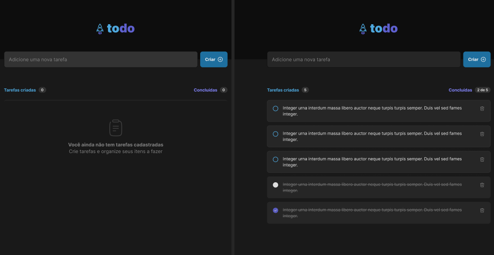

<h1 align="center"> To-Do List </h1>

Este é um projeto de **controle de tarefas** (To-Do List) desenvolvido com **ReactJS** como parte do desafio da Rocketseat na trilha Ignite. A aplicação tem como objetivo gerenciar tarefas, permitindo que o usuário adicione, marque como concluída, remova e visualize o progresso das tarefas.

## Funcionalidades

- **Adicionar novas tarefas**: O usuário pode adicionar tarefas à lista.
- **Marcar/desmarcar tarefas como concluídas**: A cada tarefa concluída, ela pode ser marcada ou desmarcada.
- **Remover tarefas**: O usuário pode remover qualquer tarefa da lista.
- **Progresso de tarefas**: A barra de progresso é atualizada conforme o usuário marca as tarefas como concluídas.

## Tecnologias Utilizadas

- **ReactJS**: Biblioteca para construção da interface.
- **CSS**: Estilização da aplicação.
- **Vite**: Ferramenta para criar e otimizar o projeto.

## Layout

A interface da aplicação foi construída com base no layout fornecido no Figma. O design foi pensado para ser simples e funcional, com uma boa experiência de usuário.

  

## Objetivo do Desafio

Este projeto foi desenvolvido para reforçar conceitos essenciais do React, como:

- **Gerenciamento de estado**: Utilizando o `useState` e manipulando o estado de forma imutável.
- **Componentização**: A aplicação foi dividida em componentes reutilizáveis, tornando o código mais organizado e modular.
- **Listas e Chaves no React**: Iteração de listas com `map()` e uso adequado de chaves únicas para cada item.

